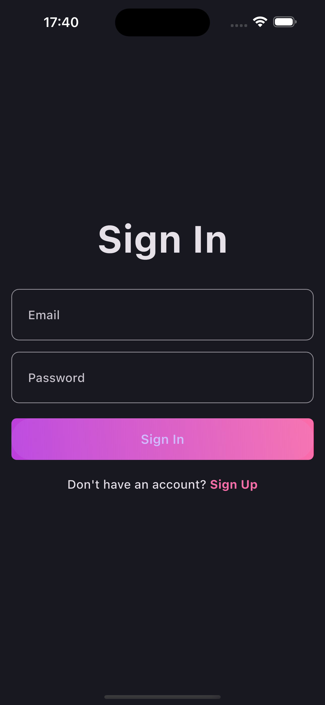
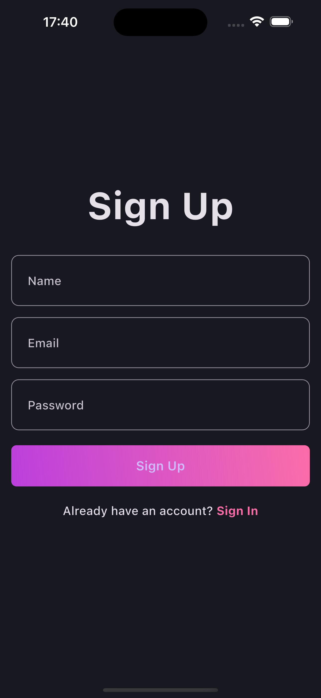
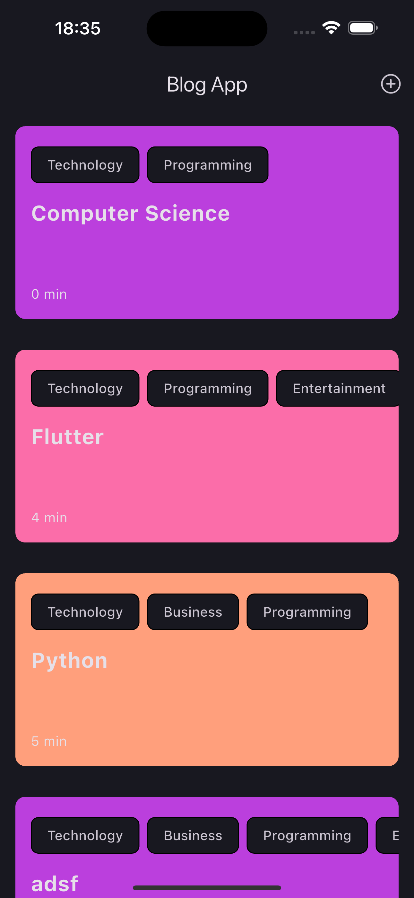
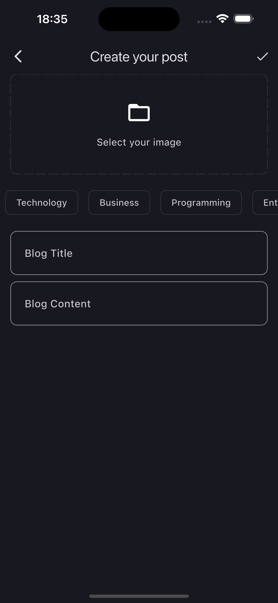
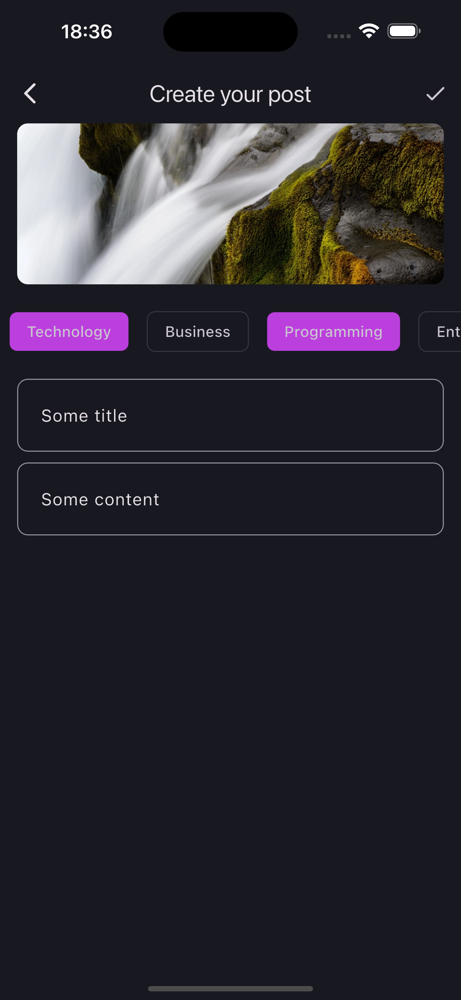

# Blog App

Blog app have been created to create some blogs of people.
[reference link](https://www.youtube.com/watch?v=ELFORM9fmss&list=PLlzmAWV2yTgCjoZNF3hLX3puYJir9vSQO)

## Table of Contents

- [Features](#features)
- [Screenshots](#screenshots)
- [Videos](#videos)
- [Installation](#installation)
- [Packages used](#packages-used)

## Features

- Sign in/Sign up
- Read all blogs
- Upload blog
- Get image from gallery
- Categories
- Detail page(read time)
- Internet connection checking

## Screenshots

  
  
  

  
  

## Videos

[Video on YouTube](https://youtu.be/CDTkN01vKhM)

## Installation

After cloning this repository go to `blog-app` folder. Then, follow the following steps:

- Create project in [supabase](https://supabase.com)
- Create secrets folder inside core folder
- Create app_secrets.dart file in secrets folder
- Get your supabase project url and supabase anon key
- Connect your keys into your project

## Packages used

- fp_dart
- supabase_flutter
- bloc
- meta
- flutter_bloc
- dotted_border
- get_it
- image_picker
- uuid
- transparent_image
- intl
- internet_connection_checker_plus
- hive
